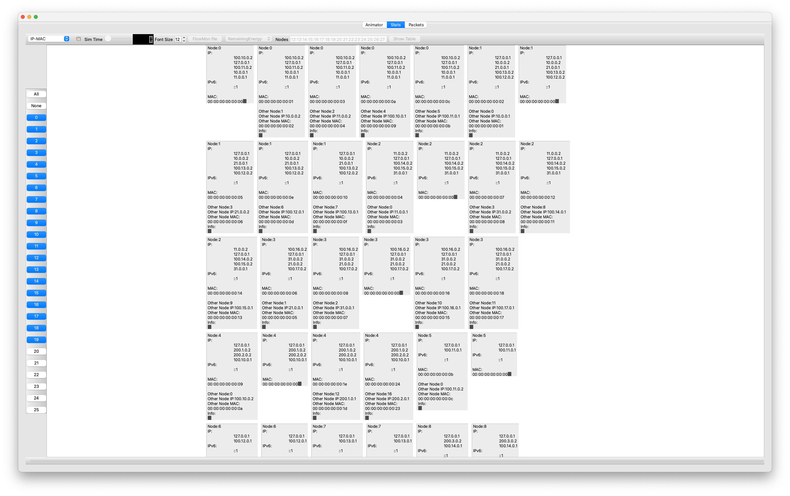

# CTSim: A Scalable and Flexible Network Simulator for Cybertwin Network

CTSim is an open-source network simulator dedicated to the Cybertwin network, based on [NS-3](https://www.nsnam.org).

Contributors: [Yuke Ma](https://myk12.github.io/), [Shihan Lin](https://github.com/SHiftLin), [Yang Chen](https://chenyang03.wordpress.com/), [Jun Wu](https://cs.fudan.edu.cn/3e/dd/c25921a278237/page.htm)


## Table of Contents

1) [Overview](#overview)
2) [Quick Start](#quick-start)
    - [Prerequisites](#prerequisites)
    - [Installation](#installation)
    - [Running CTSim](#running-ctsim)
    - [Visiualization](#visiualization)
3) [Build Network](#build-network)
    - [Network Topology](#network-topology)
    - [System Configuration](#system-configuration)
    - [Applications](#applications)
4) [Key Network Functions](#key-network-functions)
    - [Cybertwin Name Resolution Service](#cybertwin-name-resolution-service)
    - [ID-aware Routing](#id-aware-routing)
    - [Multi-stream Fusion Protocol](#multi-stream-fusion-protocol)
    - [Security Enhancement Suite](#security-enhancement-suite)
5) [References](#references)

## Overview


The **Cybertwin network** is a new network architecture that aims to replace the traditional end-to-end communication model with a cybertwin-based approach. 
It introduces the Cybertwin concept into networking and presents a new communication model. 
Additionally, it introduces a novel cloud network operating system and cloud operator to manage network resources. 
Key concepts of the Cybertwin network include infrastructure, the Cybertwin based communication model, the cloud network operating system, and the cloud operator. 
For more details, see [[1](#ref1)].


To facilitate the research and development of the Cybertwin network, we have developed this network simulator called **CTSim**. 
CTSim is an open-source network simulator dedicated to the Cybertwin network, based on [NS-3](https://www.nsnam.org). 
- First, CTSim simulates the core of the Cybertwin network—communication models based on Cybertwin. 
- Second, CTSim uses a YAML-based configuration language to construct the topology of the Cybertwin network, which includes a set of YAML configuration syntax and a YAML file parser. This approach significantly reduces the overhead for users to build the network. 
- Lastly, CTSim outputs the simulated network topology and results in a visual format, providing researchers and practitioners with sufficient information to analyze the simulation process and outcomes.

Moreover, based on the Cybertwin communication model, CTSim also implements ID-aware Routing, Multi-stream Fusion Protocol, and Security Enhancement Suite to enhance the network’s mobility, availability, and security.

## Quick Start

### Prerequisites

- [NS-3](https://www.nsnam.org) (version 3.33 or later)
- [Python](https://www.python.org) (version 3.6 or later)
- [CMake](https://cmake.org) (version 3.1 or later)

### Installation

1. Clone the repository:

```bash
git clone https://github.com/myk12/CTSim.git
```

2. Change to the CTSim directory:

```bash
cd CTSim
```

3. Install the required Python packages:

```bash
pip install -r requirements.txt
```

### Running CTSim

1. Define the network topology, system configuration, and applications in the YAML files.

2. Configure 

    ```bash
    ./ctsim configure
    ```

3. Compile the network:

    ```bash
    ./ctsim build
    ```

4. Run the simulation:

    ```bash
    ./ctsim run
    ```

### Visiualization

1. Install NetAnim

    NetAnim is a visualization tool for network simulation. To install NetAnim, run the following commands:

    ```bash
    sudo apt-get install qt5-default
    sudo apt-get install libqt5svg5-dev
    git clone https://gitlab.com/nsnam/netanim.git
    cd netanim
    qmake NetAnim.pro
    make
    ```

    Our source code has already integrated the NetAnim module. All you need to do is to config the Qt5 dependency and compile the source code.

2. Open the `cybertwin.xml` with NetAnim

    ```bash
    ./netanim/NetAnim cybertwin.xml
    ```
3. Analyze the results with NetAnim

    NetAnim is a standalone, Qt5-based software executable that uses a trace file generated during an ns-3 simulation to display the topology and animate the packet flow between nodes.

    1) animate the network topology

    

    2) detailed information of nodes
    
    

    3) packet flow between nodes

    


## Build Network

To build a network in CTSim, users need to define the network topology, system configuration, and applications in YAML files (Quite easy than writing C++ code in NS-3).

### Network Topology

Cybertwin network is a hierarchical network architecture that consists of three layers: **core**, **edge**, and **access**. 
- The core layer is the backbone of the network and connects the edge and access layers. 
- The edge layer connects the core and access layers and provides services to the access layer. 
- The access layer connects end devices to the network. 

The network topology is defined in a YAML file. The following is an example of a network topology file:

```yaml
cybertwin_network:
  # Core Layer
  # The Core Layer is the backbone of the network and is responsible for routing traffic between different parts of the network.

  core_layer:
    description: Core Layer of the Cybertwin Network
    nodes:
      - name: core_node1
        type: host_server
        position: [20, 5, 0]
        connections:
          - target: core_node2
            network: 10.0.0.0/8
            data_rate: 10Gbps
            delay: 10ms

          - target: core_node3
            network: 11.0.0.0/8
            data_rate: 10Gbps
            delay: 10ms
    
    ...

  # Edge Layer
  # The Edge Layer is responsible for routing traffic between the Access Layer and the Core Layer.

  edge_layer:
    description: Edge Layer of the Cybertwin Network
    nodes:
      - name: edge_node1
        type: host_server
        position: [15, 30, 0]
        connections:
          - target: core_node1
            network: 100.10.0.0/16
            data_rate: 1Gbps
            delay: 20ms

  ...
      
  # Access Layer
  # The Access Layer is responsible for connecting end devices to the network.

  access_layer:
    description: Access Layer of the Cybertwin Network
    nodes:
      - name: access_net1
        type: end_cluster
        position: [10, 50, 0]
        num_nodes: 4
        network_type: csma
        local_network: 192.168.1.0/24
        gateways:
          - target: edge_node1
            network: 200.1.0.0/16
            data_rate: 100Mbps
            delay: 20ms

  ...

  cnrs:
    description : Cybertwin Name Resolution Service
    central_node: core_node1

```

This generally includes two main parts: one part is related to the definition of the network topology, and the other part is about the configuration of the CNRS service.

For the network topology defination part, it is further divided into three components as the Cybertwin network consists
of three hierarch.

1. Core Layer: This layer is the backbone of the network and is responsible for routing traffic between different parts of the network.

2. Edge Layer: This layer is responsible for routing traffic between the Access Layer and the Core Layer. It is also where the Cybertwins are located.

3. Access Network Layer: This layer is responsible for connecting end devices to the network.

In the network topology file, the `cybertwin_network` key specifies the network topology. The `core_layer` key specifies the core layer of the network, the `edge_layer` key specifies the edge layer of the network, and the `access_layer` key specifies the access layer of the network. 

Each layer has a `description` key that specifies the description of the layer and a `nodes` key that specifies the nodes in the layer.

For each node, the `name` key specifies the name of the node, the `type` key specifies the type of the node, the `position` key specifies the position in the NetAnim visualization, and the `connections` key specifies the connections of the node. Each connection has a `target` key that specifies the target node, a `network` key that specifies the network address of the connection, a `data_rate` key that specifies the data rate of the connection, and a `delay` key that specifies the delay of the connection.

For the `end_cluster` type, the `num_nodes` key specifies the number of nodes in the cluster, the `network_type` key specifies the network type of the cluster, the `local_network` key specifies the local network address of the cluster, and the `gateways` key specifies the gateways of the cluster. Each gateway has a `target` key that specifies the target node, a `network` key that specifies the network address of the gateway, a `data_rate` key that specifies the data rate of the gateway, and a `delay` key that specifies the delay of the gateway.

Users can define their own network topologies by modifying the network topology file without changing the source code.

### System Configuration

The system configuration is defined in a YAML file. The following is an example of a system configuration file:

```yaml
# Define the System Configuration of the Cybertwin Network

ID-aware-routing:
  enabled: true

Multi-stream-fusion:
  enabled: true
  max-streams: 4

Security-enhancement:
  enabled: true
  encryption: true
  authentication: true
  integrity: true
  firewall: true

```

This generally includes three main parts: ID-aware routing, Multi-stream fusion, and Security enhancement.

1. ID-aware Routing: ID-aware routing is a routing mechanism that uses the Cybertwin ID to route packets in the Cybertwin network. It is enabled by default.

2. Multi-stream Fusion: Multi-stream fusion is a protocol that fuses multiple streams into a single stream to improve the network's mobility and availability. It is enabled by default and supports up to 4 streams.

3. Security Enhancement: Security enhancement is a suite of security mechanisms that enhance the network's security. It is enabled by default and includes encryption, authentication, integrity, and firewall.


### Applications

Applications are defined in a YAML file. The following is an example of an applications file:

```yaml
# Define the Applications that run on the Cybertwin Network
# We describe each nodes of their applications and their properties

# Applications
applications:
  - name: download-client
    description: Download Client Application
    type: download-client
    enabled: true
    start_delay: 0
    target_nodes:
      - access_net1_0
      - access_net1_1
    parameters:
      - start-delay: 0
        target-cybertwin-id: 1000

    ...

  - name: download-server
    description: Download Server Application
    type: download-server
    enabled: true
    start_delay: 0
    target_nodes:
      - core_node1
    parameters:
      - start-delay: 0
        cybertwin-id: 1000
        cybertwin-port: 1000
        max-size: 100MB
```

This generally includes two main parts: one part is related to the definition of the applications, and the other part is about the configuration of the applications.

## Key Network Functions

Leverage the Cybertwin communication model, CTSim implements several key network functions to enhance the network's mobility, availability, and security.

### Cybertwin Name Resolution Service

The Cybertwin Name Resolution Service (CNRS) is a service that maps Cybertwin IDs to network addresses. It is implemented as a centralized service in the core layer of the network. The CNRS is responsible for resolving Cybertwin IDs to network addresses and vice versa. The CNRS is used by the ID-aware routing mechanism to route packets in the Cybertwin network.

### ID-aware Routing


We have developed an ID-aware Routing mechanism where routing devices consider both the destination network address and the destination ID during route lookups. Each network entity is assigned a unique identifier, which is added to the network layer alongside the IP address. When a router receives a data packet for routing, it checks if there have been updates to the network address associated with the packet's destination ID. If changes are detected, routing prioritizes the updated network address, ensuring packets reach the correct destination even if network addresses change due to mobility. This ID-aware routing approach facilitates seamless mobility support within the network architecture.

### Multi-stream Fusion Protocol

Advancements in communication technology have introduced various network access methods for devices, such as Ethernet, WiFi, and cellular networks (4G, 5G). As a result, modern devices often feature multiple network interfaces; for instance, mobile devices can connect via both WiFi and cellular networks, while laptops may have Ethernet and WiFi adapters. Leveraging multiple network interfaces is crucial for improving end-to-end performance and reliability.


We introduce the Multi-Stream Fusion Protocol (MSFP). This figure illustrates the position of MSFP within the transport layer, serving as a multi-stream management module. It oversees multiple substreams across various transport layer protocols and provides an application programming interface (API) similar to a standard socket to the upper layers (e.g. application layer).


### Security Enhancement Suite

The increasing reliance on digitization, the development of the Internet of Things (IoT), and the widespread adoption of big data and cloud computing, among other trends, have elevated networks to the status of societal infrastructure. The security of Internet is directly linked to the normal functioning of society, national security, and individual privacy. 


Although the definition of the zero trust network architecture is relatively clear, there are many specific technical specifications. Among them, we take the zero trust network architecture deployment model~\cite{nist-zero-trust-architecture} released by the National Institute of Standards and Technology (NIST) in the United States as a reference. Using this as a blueprint, we designed and implemented the Security Enhancement Suite in FISim.

## References

<a id="ref1"></a>[1] [Quan Yu, Jing Ren, et al . 2019. Cybertwin: An Origin of Next Generation Network Architecture. IEEE Wirel. Commun. 26, 6 (2019), 111–117.](https://ieeexplore.ieee.org/document/8910636)
